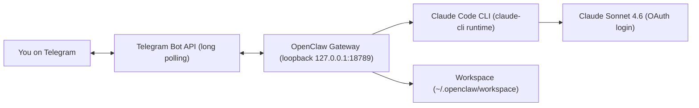

# Lobi — Personal AI Agent on Telegram

**Lobi** ([@lobi_ai_bot](https://t.me/lobi_ai_bot)) is a personal AI assistant you talk to from
Telegram. It runs on [OpenClaw](https://openclaw.ai) and is backed by the **Claude Code CLI**
driving **Claude Sonnet 4.6** — so the agent can read/write files and run commands on the host
machine, all from a chat message.

This repo documents the setup and ships a sanitized config template plus an automated setup
script. **It contains no live secrets** — see [Security](#security).

## How it works



- **Channel:** Telegram via long-polling — no public webhook or open port needed.
- **Gateway:** the OpenClaw process. Listens on `127.0.0.1:18789` (loopback only) and is installed
  as a Windows Scheduled Task that starts at logon.
- **Agent runtime:** OpenClaw routes the model `anthropic/claude-sonnet-4-6` through the local
  **`claude-cli`** backend, which reuses your existing Claude Code OAuth login — **no separate API
  key required**.
- **Workspace:** the agent works inside `~/.openclaw/workspace`, isolated from your other projects.

## Prerequisites

- **Windows 10 (20H2+) or Windows 11**
- **Node.js 18+** — check with `node --version`
- **Claude Code** installed and logged in — check with `claude --version`. The `claude-cli` backend
  reuses this login, so make sure `claude` works on its own first.
- A **Telegram bot token** from [@BotFather](https://t.me/BotFather) (`/newbot`).

## Setup

### Option A — automated (this repo)

```powershell
# from the repo folder
./setup.ps1
```

`setup.ps1` checks prerequisites, installs OpenClaw if needed, writes `~/.openclaw/openclaw.json`
from [`openclaw.example.json`](openclaw.example.json) (prompting for your bot token + Telegram user
ID, and generating a random gateway token), validates it, then installs and starts the gateway.

### Option B — OpenClaw guided onboarding

```powershell
npm install -g openclaw
# make sure Claude Code is logged in:
claude --version

openclaw onboard
```

When prompted by `openclaw onboard`, choose:

- **Agent runtime:** Claude CLI (`claude-cli`)
- **Model:** `anthropic/claude-sonnet-4-6`
- **Channel:** Telegram — paste your BotFather token

Then bring it online and pair your account:

```powershell
openclaw gateway install      # register as a Windows Scheduled Task
openclaw gateway start
openclaw gateway status

# DM your bot once (e.g. /start), then:
openclaw pairing list telegram
openclaw pairing approve telegram <CODE>
```

Approving the pairing also writes you into `commands.ownerAllowFrom`, so only your account can run
commands through the bot.

[`openclaw.example.json`](openclaw.example.json) shows what the resulting config should look like
(with secrets redacted).

## Configuration reference

| Field | Meaning |
|-------|---------|
| `agents.defaults.model.primary` | Active model — `anthropic/claude-sonnet-4-6`. Switch from chat with the `sonnet` / `opus` aliases. |
| `agents.defaults.models.<id>.agentRuntime.id` | `claude-cli` → run this model through the local Claude Code CLI. |
| `auth.profiles."anthropic:claude-cli"` | OAuth profile; reuses your Claude Code login (no API key). |
| `channels.telegram.botToken` | Your BotFather token. **Secret — never commit.** |
| `channels.telegram.dmPolicy` | `pairing` (default) — strangers must be approved before they can DM. |
| `channels.telegram.groups."*".requireMention` | In any group, the bot only replies when mentioned. |
| `commands.ownerAllowFrom` | Whitelist of who can run commands. Lock it to your own `telegram:<id>`. |
| `tools.profile` | `coding` — gives the agent file + shell tools. |
| `gateway.bind` | `loopback` — gateway reachable only from this machine. |
| `gateway.auth.token` | Shared secret for local clients. **Secret.** Generated automatically. |

## Usage

- DM [@lobi_ai_bot](https://t.me/lobi_ai_bot) anything — Sonnet 4.6 replies and can act on the host.
- Switch model mid-chat using the configured aliases (`sonnet`, `opus`).
- Add the bot to a group: it only replies when mentioned.

## Management

```powershell
openclaw status                 # gateway + channel + model overview
openclaw channels status        # Telegram connection state
openclaw gateway start|stop|status
openclaw logs --follow          # live logs
openclaw models status          # model / auth health
openclaw pairing list telegram  # pending DM pairing requests
```

## Security

- **Never commit your real `~/.openclaw/openclaw.json`.** It holds the bot token and the gateway
  auth token. This repo's `.gitignore` blocks it; only the redacted `openclaw.example.json` is
  tracked.
- **The bot can run commands on the host.** With `tools.profile: coding`, anything an approved user
  sends is executed by Claude Code on this machine. Keep `commands.ownerAllowFrom` limited to you
  and leave `dmPolicy: pairing` on.
- **Rotate a leaked bot token** via [@BotFather](https://t.me/BotFather) → `/revoke`, then update
  `channels.telegram.botToken` and restart the gateway.
- The gateway binds to `loopback` only. If you ever enable `gateway.controlUi.allowInsecureAuth`,
  run `openclaw security audit` to review the exposure.

## Windows note: gateway not auto-restarting

OpenClaw self-restarts on certain config changes (for example, approving a pairing). The Windows
Scheduled Task starts at **logon** but does **not** relaunch the process if it exits mid-session
(`RestartCount = 0`). If `openclaw status` shows the gateway stopped after a config change, bring it
back with:

```powershell
openclaw gateway start
```

To make it auto-recover from crashes (optional):

```powershell
$t = Get-ScheduledTask -TaskName "OpenClaw Gateway"
$t.Settings.RestartCount = 3
$t.Settings.RestartInterval = "PT1M"
$t | Set-ScheduledTask
```

## Troubleshooting

| Symptom | Fix |
|---------|-----|
| Telegram shows `disconnected` right after start | Warm-up; polling connects ~15s after launch. Re-check `openclaw channels status`. |
| `GatewayTransportError ... 1006 abnormal closure` | Gateway was restarting/down. Run `openclaw gateway start`, then retry. |
| Bot doesn't reply | Confirm you're paired (`openclaw pairing list telegram`) and present in `commands.ownerAllowFrom`. |
| Anything else weird | `openclaw doctor --fix` |

## References

- OpenClaw docs — https://docs.openclaw.ai
- Telegram channel — https://docs.openclaw.ai/channels/telegram
- Claude CLI backend — https://docs.openclaw.ai/gateway/cli-backends
- Claude Code — https://claude.com/claude-code
