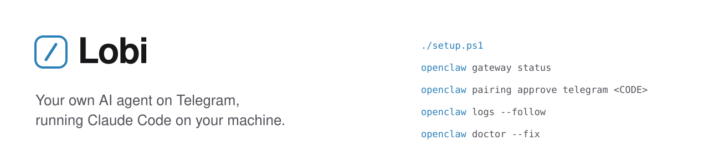
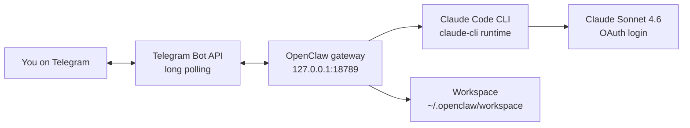

<picture>
  <source media="(prefers-color-scheme: dark)" srcset="./assets/banner-dark.svg">
  
</picture>

<p>
  
  
  
</p>

Lobi ([@lobi_ai_bot](https://t.me/lobi_ai_bot)) is a personal AI agent you message on Telegram. It runs on your own Windows machine through [OpenClaw](https://openclaw.ai) and the Claude Code CLI with Claude Sonnet 4.6, so it can read files and run commands there. It reuses your Claude Code login, so no API key is needed.

This repo holds the setup script, a redacted config template and these docs. It contains no live secrets.

> [!WARNING]
> Anyone you approve can run commands on this machine through the bot. Keep `commands.ownerAllowFrom` set to your own Telegram account, and leave `dmPolicy` on `pairing`.

## Quick start

Before you start, you need Windows 10 (20H2 or later) or 11, Node.js 18+, a logged-in [Claude Code](https://claude.com/product/claude-code), and a bot token from [@BotFather](https://t.me/BotFather) (`/newbot`).

```powershell
git clone https://github.com/philong-buile/lobi_agent.git
cd lobi_agent
./setup.ps1

# DM your bot once (for example /start), then approve yourself:
openclaw pairing list telegram
openclaw pairing approve telegram <CODE>
```

`setup.ps1` asks for your bot token and your numeric Telegram user ID. To skip the prompts, pass them in: `./setup.ps1 -BotToken "<token>" -TelegramUserId "<id>"`.

<details>
<summary>Prefer OpenClaw's guided onboarding instead of the script?</summary>

```powershell
npm install -g openclaw
claude --version              # Claude Code must be logged in
openclaw onboard
```

When prompted, choose:

- **Agent runtime:** Claude CLI (`claude-cli`)
- **Model:** `anthropic/claude-sonnet-4-6`
- **Channel:** Telegram, then paste your BotFather token

Then start the gateway and pair your account:

```powershell
openclaw gateway install      # registers a Windows Scheduled Task
openclaw gateway start
openclaw gateway status
openclaw pairing list telegram
openclaw pairing approve telegram <CODE>
```

Approving the pairing also adds you to `commands.ownerAllowFrom`, so only your account can run commands. [`openclaw.example.json`](openclaw.example.json) shows what the resulting config looks like, with secrets redacted.

</details>

## What's in the repo

| File | What it does |
| --- | --- |
| [`setup.ps1`](setup.ps1) | Checks prerequisites, installs OpenClaw if needed, and writes `~/.openclaw/openclaw.json` from the template with your bot token, your user ID and a random 48-character gateway token. Then it validates the config, backs up any existing one, and installs and starts the gateway. |
| [`openclaw.example.json`](openclaw.example.json) | The redacted config template that the script fills in. |
| [`.gitignore`](.gitignore) | Keeps the real config, tokens, state databases and logs out of git. |

## Usage

- **DM** [@lobi_ai_bot](https://t.me/lobi_ai_bot), or your own bot. Sonnet 4.6 replies and can act on the host.
- **Switch models** mid-chat with the configured aliases, `sonnet` and `opus`.
- **Groups:** add the bot to a group, and it replies only when mentioned.

## How it works



| Part | How it is set up |
| --- | --- |
| **Channel** | Telegram uses long polling, so you need no public webhook and no open port. |
| **Gateway** | The OpenClaw process listens on `127.0.0.1:18789`, loopback only. It runs as a Windows Scheduled Task that starts at logon. |
| **Agent runtime** | OpenClaw routes `anthropic/claude-sonnet-4-6` through the local `claude-cli` backend, which reuses your Claude Code OAuth login. |
| **Workspace** | The agent works inside `~/.openclaw/workspace`, apart from your other projects. |

## Configuration

| Field | Meaning |
| --- | --- |
| `agents.defaults.model.primary` | Active model, `anthropic/claude-sonnet-4-6`. Switch from chat with the `sonnet` and `opus` aliases. |
| `agents.defaults.models.<id>.agentRuntime.id` | `claude-cli` runs that model through the local Claude Code CLI. |
| `auth.profiles."anthropic:claude-cli"` | OAuth profile that reuses your Claude Code login. No API key. |
| `channels.telegram.botToken` | Your BotFather token. **Secret, never commit it.** |
| `channels.telegram.dmPolicy` | `pairing` (default): strangers must be approved before they can DM. |
| `channels.telegram.groups."*".requireMention` | In any group, the bot replies only when mentioned. |
| `commands.ownerAllowFrom` | Who can run commands. Lock it to your own `telegram:<id>`. |
| `tools.profile` | `coding` gives the agent file and shell tools. |
| `gateway.bind` | `loopback`: the gateway is reachable only from this machine. |
| `gateway.auth.token` | Shared secret for local clients. **Secret.** The setup script generates it. |

## Operations

```powershell
openclaw status                   # gateway, channel and model overview
openclaw channels status          # Telegram connection state
openclaw gateway start            # also: stop, status
openclaw logs --follow            # live logs
openclaw models status            # model and auth health
openclaw pairing list telegram    # pending DM pairing requests
```

| Symptom | Fix |
| --- | --- |
| Telegram shows `disconnected` right after start | Polling connects about 15 s after launch. Check `openclaw channels status` again. |
| `GatewayTransportError ... 1006 abnormal closure` | The gateway was restarting or down. Run `openclaw gateway start` and retry. |
| The bot does not reply | Confirm you are paired (`openclaw pairing list telegram`) and listed in `commands.ownerAllowFrom`. |
| The gateway stopped after a config change | See the note below, then run `openclaw gateway start`. |
| Anything else | `openclaw doctor --fix` |

<details>
<summary>Windows note: the gateway does not restart itself</summary>

OpenClaw restarts itself on some config changes, for example after you approve a pairing. The Scheduled Task starts the gateway at logon, but does not relaunch it if it exits mid-session (`RestartCount = 0`). To have Windows bring it back after a crash:

```powershell
$t = Get-ScheduledTask -TaskName "OpenClaw Gateway"
$t.Settings.RestartCount = 3
$t.Settings.RestartInterval = "PT1M"
$t | Set-ScheduledTask
```

</details>

## Security

- **Never commit your real `~/.openclaw/openclaw.json`.** It holds the bot token and the gateway token. The `.gitignore` blocks it; only the redacted `openclaw.example.json` is tracked.
- **The bot runs commands on the host.** With `tools.profile: coding`, Claude Code executes on this machine whatever an approved user sends. Keep `commands.ownerAllowFrom` limited to you and leave `dmPolicy: pairing` on.
- **If the bot token leaks,** revoke it with [@BotFather](https://t.me/BotFather) (`/revoke`), update `channels.telegram.botToken`, and restart the gateway.
- **The gateway binds to loopback only.** If you ever enable `gateway.controlUi.allowInsecureAuth`, run `openclaw security audit` to review the exposure.

## Links

- [OpenClaw docs](https://docs.openclaw.ai)
- [Telegram channel](https://docs.openclaw.ai/channels/telegram)
- [Claude CLI backend](https://docs.openclaw.ai/gateway/cli-backends)
- [Claude Code](https://claude.com/product/claude-code)
